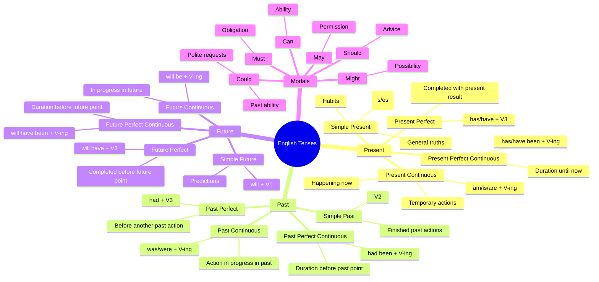

```text
English Tenses
├── Present
│   ├── Simple Present (S + V(s/es))
│   ├── Present Continuous (am/is/are + V-ing)
│   ├── Present Perfect (has/have + V3)
│   └── Present Perfect Continuous (has/have been + V-ing)
│
├── Past
│   ├── Simple Past (V2)
│   ├── Past Continuous (was/were + V-ing)
│   ├── Past Perfect (had + V3)
│   └── Past Perfect Continuous (had been + V-ing)
│
├── Future
│   ├── Simple Future (will + V1)
│   ├── Future Continuous (will be + V-ing)
│   ├── Future Perfect (will have + V3)
│   └── Future Perfect Continuous (will have been + V-ing)
│
└── Modals
    ├── Can / Could
    ├── May / Might
    ├── Must
    └── Should
```



