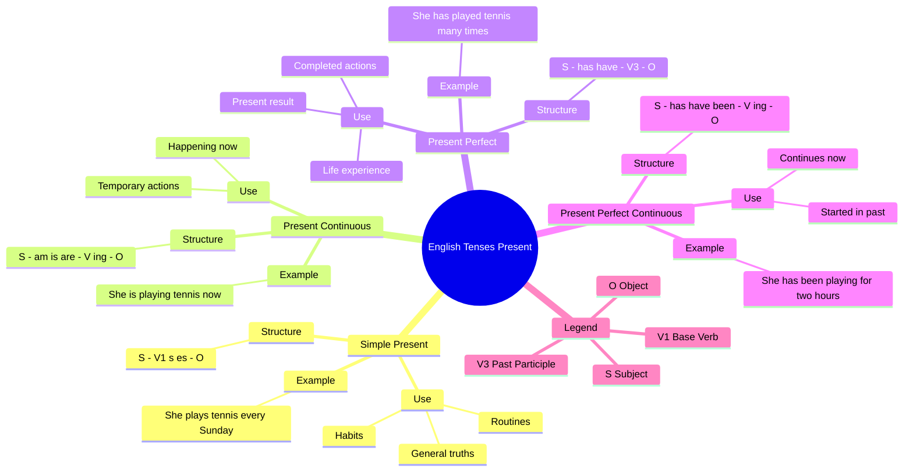
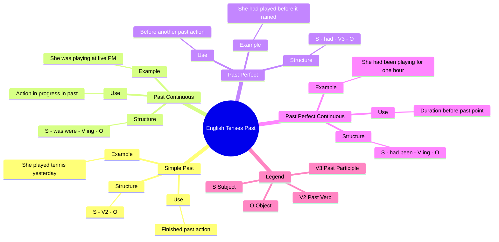
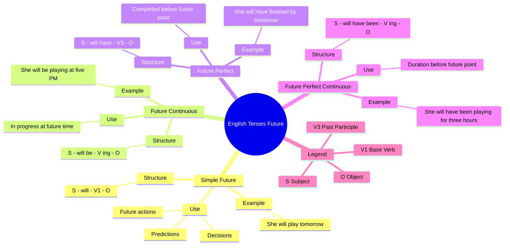
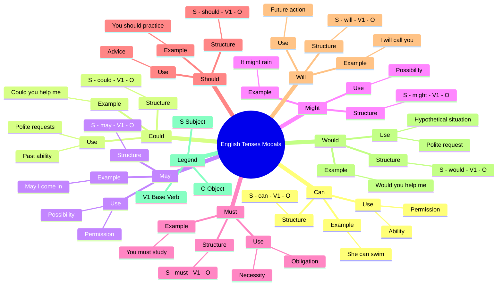

# Present Tenses

```mermaid
mindmap
  root((English Tenses Present))

    Simple Present
      Structure
        S - V1 s es - O
      Use
        Habits
        Routines
        General truths
      Example
        She plays tennis every Sunday

    Present Continuous
      Structure
        S - am is are - V ing - O
      Use
        Happening now
        Temporary actions
      Example
        She is playing tennis now

    Present Perfect
      Structure
        S - has have - V3 - O
      Use
        Completed actions
        Life experience
        Present result
      Example
        She has played tennis many times

    Present Perfect Continuous
      Structure
        S - has have been - V ing - O
      Use
        Started in past
        Continues now
      Example
        She has been playing for two hours

    Legend
      S Subject
      V1 Base Verb
      V3 Past Participle
      O Object
```

***

# Past Tenses

```mermaid
mindmap
  root((English Tenses Past))

    Simple Past
      Structure
        S - V2 - O
      Use
        Finished past action
      Example
        She played tennis yesterday

    Past Continuous
      Structure
        S - was were - V ing - O
      Use
        Action in progress in past
      Example
        She was playing at five PM

    Past Perfect
      Structure
        S - had - V3 - O
      Use
        Before another past action
      Example
        She had played before it rained

    Past Perfect Continuous
      Structure
        S - had been - V ing - O
      Use
        Duration before past point
      Example
        She had been playing for one hour

    Legend
      S Subject
      V2 Past Verb
      V3 Past Participle
      O Object
```

***

# Future Tenses

```mermaid
mindmap
  root((English Tenses Future))

    Simple Future
      Structure
        S - will - V1 - O
      Use
        Predictions
        Decisions
        Future actions
      Example
        She will play tomorrow

    Future Continuous
      Structure
        S - will be - V ing - O
      Use
        In progress at future time
      Example
        She will be playing at five PM

    Future Perfect
      Structure
        S - will have - V3 - O
      Use
        Completed before future point
      Example
        She will have finished by tomorrow

    Future Perfect Continuous
      Structure
        S - will have been - V ing - O
      Use
        Duration before future point
      Example
        She will have been playing for three hours

    Legend
      S Subject
      V1 Base Verb
      V3 Past Participle
      O Object
```

***

# Modal Verbs

```mermaid
mindmap
  root((English Tenses Modals))

    Can
      Structure
        S - can - V1 - O
      Use
        Ability
        Permission
      Example
        She can swim

    Could
      Structure
        S - could - V1 - O
      Use
        Past ability
        Polite requests
      Example
        Could you help me

    May
      Structure
        S - may - V1 - O
      Use
        Permission
        Possibility
      Example
        May I come in

    Might
      Structure
        S - might - V1 - O
      Use
        Possibility
      Example
        It might rain

    Must
      Structure
        S - must - V1 - O
      Use
        Obligation
        Necessity
      Example
        You must study

    Should
      Structure
        S - should - V1 - O
      Use
        Advice
      Example
        You should practice

    Will
      Structure
        S - will - V1 - O
      Use
        Future action
      Example
        I will call you

    Would
      Structure
        S - would - V1 - O
      Use
        Polite request
        Hypothetical situation
      Example
        Would you help me

    Legend
      S Subject
      V1 Base Verb
      O Object
```
